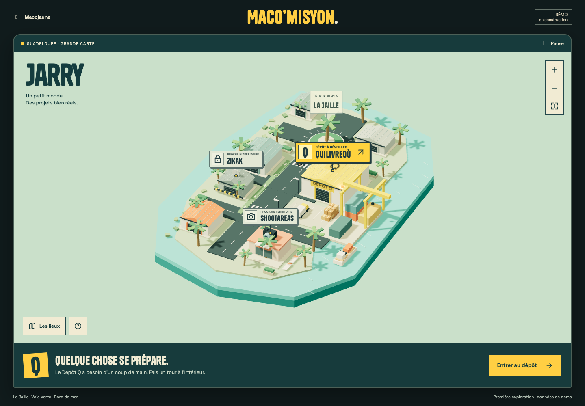
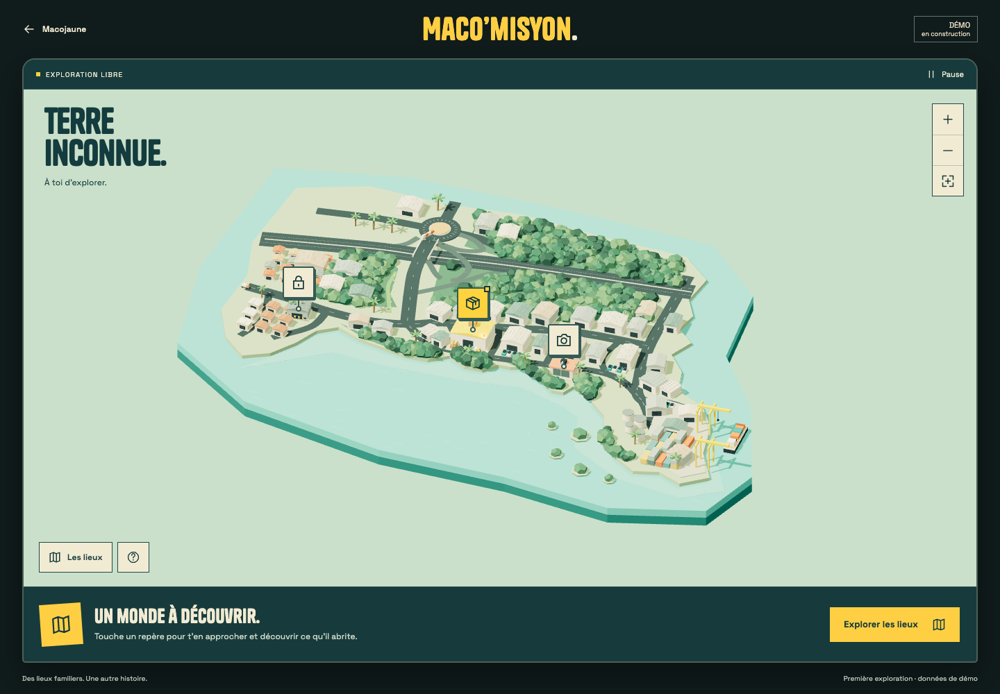

# Évolution du monde

Ces captures proviennent du navigateur local, avec le même cadre de jeu. Elles documentent le rendu réel de chaque étape, sans retouche. Les captures bureau font 1440 × 1000 pixels ; les captures mobile proviennent d'une émulation Chromium à 390 × 844 pixels.

## 11 · Première intégration Nuxt

Repère Git : `macomisyon/11-nuxt-jarry-v1`, commit `ba7a2d2`.

La première carte réunit l'îlot industriel, les noms de projets visibles et l'accès au Dépôt Q. Les images sont celles de sa vérification, conservées avant la reprise géographique.

[Vue mobile](11-nuxt-jarry-v1/mobile.png)

## 12 · Monde littoral, découverte des projets

Repère Git : `macomisyon/12-monde-littoral-v2`.

La silhouette et les grands axes sont reconstruits d'après les deux vues aériennes fournies par Marvin. Les murets du giratoire suivent son indication à 7 h. Les repères deviennent des pictogrammes ; les noms des projets se découvrent à l'intérieur.

[Vue mobile](12-monde-littoral-v2/mobile.png)

[Détail du giratoire et des murets](12-monde-littoral-v2/junction.png)

