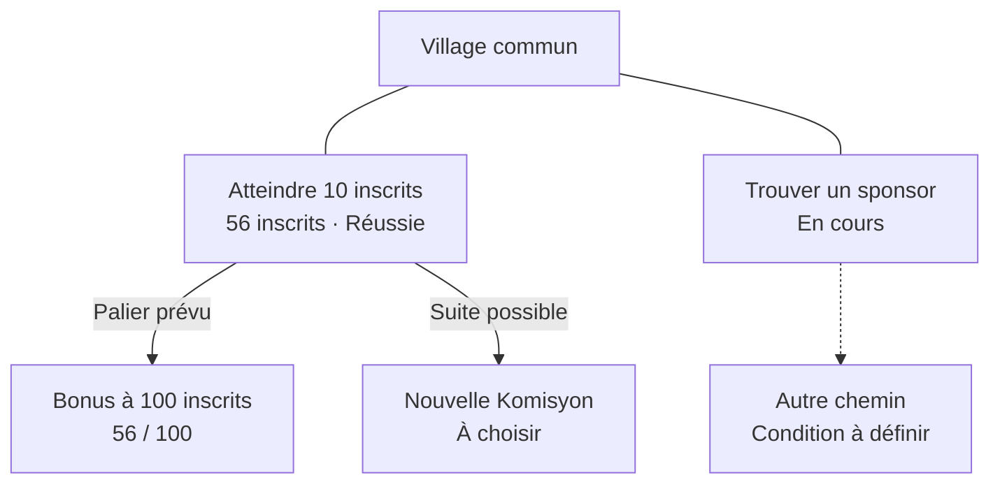

# Maco’misyon, première mise à l’épreuve
Date : 10 septembre 2026.
Mise à jour : 11 septembre 2026, après la deuxième série de réponses.
Complément : [proposition de game design du 11 septembre](./proposition-game-design-2026-09-11.md), préparée après la demande de rechercher une notion regroupant plusieurs Komisyon.
Statut : note de travail. Les recommandations ci-dessous sont à discuter. Elles ne remplacent pas les décisions de Marvin.

Source lue intégralement : [Maco'misyon · Synthèse fondatrice](https://drive.google.com/file/d/1JGOO_S5Ht72q_g-UE3ZMAHN6rTAYkUq6/view?usp=drivesdk).

## Ce que je retiens de la vision

Macojaune expérimente et fabrique des choses. Maco’misyon donne au public une façon de les explorer et d’y participer. Une Komisyon possède une finalité explicite, comme atteindre 10 inscrits sur un site ou trouver un sponsor pour QuiLivreOù. Les exemples de Marvin mettent la participation au cœur de l’objectif. La réussite peut être dépassée et des paliers supplémentaires peuvent avoir été prévus. La map conserve les résultats et donne accès aux possibilités suivantes. Un lancement de produit, à lui seul, ne décrit pas la dimension participative que Marvin cherche ici.

Les décisions déjà prises restent la base : Maco’misyon est le jeu, les missions sont des Komisyon, macojaune.com est le hub, les origines des missions partagent le même système. La map de sélection est voulue ; sa réalisation visuelle reste ouverte. Marvin garde ses différentes activités et avance sans cadence de publication imposée. Zikak est le moteur pressenti. Aucun numéro de Komisyon n’est attribué ici.

Le plaisir de fabriquer et d’explorer cet univers fait partie de sa valeur. Un premier essai doit conserver quelque chose à découvrir et un effet perceptible.

## Mon diagnostic provisoire

Le lien participation → conséquence visible est l’hypothèse centrale. La diversité des projets peut nourrir cet univers si le visiteur comprend chaque proposition sans connaître toute l’histoire de Marvin.

Quatre tensions demandent une réponse concrète :

- Une map publique peut rendre les projets et leur évolution attirants. Des seuils durablement vides peuvent aussi reproduire la pression des statistiques que le projet cherche à alléger.
- Le public doit pouvoir produire un véritable effet. Le pouvoir accordé doit rester compatible avec les envies de Marvin.
- Préparer des contenus à l’avance peut aider à publier. Concevoir chaque déclencheur, produire les récompenses et résoudre les exceptions ajoutent cependant du travail.
- Les visiteurs peuvent aimer une seule activité. La circulation entre photo, applications et autres projets est une hypothèse à observer, pas un comportement à exiger.

## Ce que le code existant permet d’affirmer

Vérification en lecture seule. Ces constats ne prouvent ni le fonctionnement actuel des services déployés, ni les capacités ou conditions actuelles des plateformes externes.

| Élément | Présent dans le code | Ce qui reste à vérifier ou à réaliser |
| --- | --- | --- |
| Cho Kaché | Page, carte, formulaire de découverte, code du tirage, contact, GPS et médias facultatifs. | Présence physique des tirages, indices prêts, configuration et parcours réellement servi. |
| Réception d’une découverte | Sauvegarde d’un signalement et de ses médias ; accord de repartage conservé. | Validation opérateur, changement de statut, lien avec Zikak, contenu révélé. |
| Zikak et réseaux | Collecteurs Instagram et TikTok via Apify. | Résultats actuels, couverture et coûts de collecte ; aucune promesse de prise en compte instantanée. |
| Zikak et points | Règles, événements, écritures de points, déduplication événement/règle. | Protections contre l’accumulation artificielle de nouvelles interactions ; plafonds non appliqués dans le moteur inspecté. |
| Identité | Membres et identités par réseau ; opérations d’ajout et de fusion. | Revendication d’un profil par son propriétaire et parcours de connexion du joueur. |
| Récompenses | Catalogue et débit de points. | Attribution effective d’un accès ou avantage, historique exploitable, livraison fiable. |
| Orchestration du jeu | Pas de Komisyon ni de déclenchement de contenu repérés dans le routeur inspecté. | Définir précisément l’action, sa preuve, sa validation et la conséquence. |
| Ancienne page Idées | Endpoint historique de votes. | La route /ideas du checkout inspecté redirige vers l’accueil ; ne pas la compter comme un parcours actif. |

Le cycle de collecte sociale inspecté attend par défaut 24 heures entre exécutions. Les likes, partages et sauvegardes TikTok ne fournissent pas de participants individuels dans cette implémentation. La présence de plusieurs identités dans Zikak ne vaut pas preuve qu’elles appartiennent à une même personne.

Le checkout racine de Macojaune est moins avancé que le worktree inspecté. Les éléments Cho Kaché cités proviennent de `.letta/worktrees/macotidien-episode-16`, commit `4c98ebd`. Zikak a été inspecté au commit `8454758`.

### Sources locales principales

- [Histoire de Cho Kaché](/Users/marvinl/Documents/DEV/macojaune-web/content/blog/cho-kache.md:25).
- [Formulaire de découverte](/Users/marvinl/Documents/DEV/macojaune-web/.letta/worktrees/macotidien-episode-16/app/components/cho-kache/ChoKacheDiscoveryForm.vue:18).
- [Enregistrement d’une découverte](/Users/marvinl/Documents/DEV/macojaune-web/.letta/worktrees/macotidien-episode-16/server/api/cho-kache/discoveries.post.ts:236).
- [Collecte périodique de Zikak](/Users/marvinl/Documents/DEV/zikak/deploy/backend-entrypoint.sh:42).
- [Traitement des événements et points](/Users/marvinl/Documents/DEV/zikak/internal/eventprocessor/processor.go:257).
- [Échange de récompense](/Users/marvinl/Documents/DEV/zikak/internal/handlers/handlers.go:795).
- [Routeur API de Zikak](/Users/marvinl/Documents/DEV/zikak/cmd/api/main.go:63).
- [Route Idées](/Users/marvinl/Documents/DEV/marvinldotcom2024/src/pages/ideas.astro:1).

## Première série de réponses de Marvin

Ces réponses priment sur les recommandations initiales de cette note.

1. **Priorité confirmée.** Retrouver du plaisir et faire aboutir des projets.
2. **Décision finale et choix disponibles.** Marvin propose les choix ouverts au public et garde le dernier mot. L’audience peut influencer les priorités dans ce périmètre et proposer des idées ou collaborations inattendues. Une suggestion ne vaut pas engagement. La liberté créative de Marvin fait partie du fonctionnement voulu.
3. **Participation et avancement réel.** Le traitement d’un seuil non atteint dépend de la Komisyon, de la criticité de la tâche et de son avancement. Aucune règle universelle de blocage ou de déblocage n’est adoptée. Une étape peut devenir acquise par le travail réel avant que le public intervienne ; un déclenchement automatique sur cet avancement est envisageable.
4. **Temps et argent à reformuler.** La question de plafond était trop abstraite pour Marvin. Aucun budget ni volume horaire n’est décidé. L’intention était d’estimer le travail supplémentaire de préparation et d’entretien ainsi que les dépenses propres au jeu. Ce chiffrage pourra s’appuyer sur un scénario concret ; il ne bloque pas l’exploration.
5. **Continuité du storytelling.** Marvin choisit les missions et les éléments mis en avant, comme il choisit déjà ce qu’il partage sur les réseaux. Maco’misyon ajoute une dimension commune et jouable à cette communication. Il n’est pas nécessaire de redéfinir toute sa frontière privée.
6. **L’IA participe au dispositif.** La préparation de contenus et la réflexion font déjà partie du rôle envisagé. Marvin cite aussi la collecte de données, la récolte de suggestions et des réponses automatiques en DM, avec d’autres usages possibles ensuite. La visibilité narrative et les modalités de ces fonctions restent ouvertes. Ces exemples expriment une intention de conception, pas une instruction d’envoyer dès maintenant des messages à l’audience.

### Conséquences proposées pour la conception

- Présenter clairement ce qu’une consultation peut influencer, tout en conservant le dernier mot de Marvin.
- Définir les conditions d’évolution au niveau de chaque Komisyon ou étape. Une interaction du public et un avancement réel peuvent fournir des raisons différentes de faire évoluer la map.
- Conserver la raison effective d’un déblocage pour raconter ce qui s’est passé sans attribuer artificiellement le résultat au public.
- Chiffrer la charge à partir d’un parcours concret. Distinguer le temps de création choisi du travail récurrent de vérification, de classement ou de correction que Marvin souhaite déléguer.
- Préciser les fonctions de l’IA au fil des parcours retenus, sans lui imposer maintenant un personnage ou un rôle unique.

## Deuxième série de réponses de Marvin, 11 septembre 2026

1. **Premiers participants identifiés.** Les potes, les mutuals et les followers les plus assidus des réseaux.
2. **Finalité d’une Komisyon précisée.** Les exemples sont atteindre 10 utilisateurs inscrits sur un site et trouver un sponsor pour QuiLivreOù. Le succès se constate quand la finalité définie est atteinte. Le choix du site, les critères précis de comptage et le fait qui confirme un sponsor restent à définir pour une mission réelle.
3. **Dépassement et paliers possibles.** Un objectif de 10 peut être dépassé, par exemple avec 56 inscrits. Un bonus, une récompense ou un niveau supplémentaire allant à 100 peut être prévu. Ces nombres illustrent la mécanique ; ils ne désignent ni les statistiques actuelles ni un lancement déjà choisi.
4. **Référence de fonctionnement.** Marvin rapproche l’idée des points, actions et objectifs de chaîne sur Twitch. Il décrit à la fois une reconnaissance individuelle de l’engagement et des résultats collectifs. Aucun barème, paiement, système de dons ou fonctionnement technique de Twitch n’est adopté par cette comparaison.
5. **Map encore à concevoir ensemble.** Marvin imagine notamment un village avec plusieurs points à compléter et des chemins vers différentes suites. Cinq points et trois chemins sont illustratifs. La carte pourrait montrer un avancement, un arbre de possibilités ou une combinaison. Aucune règle de passage à l’étape suivante ni décision sur la représentation n’est arrêtée.

### Proposition à discuter : un village avec des chemins vers la suite

Le village est un repère partagé. Plusieurs Komisyon y sont accessibles en parallèle. Chacune affiche son résultat réel et son prochain palier éventuel. Les chemins montrent ce qui devient possible ensuite. Les lieux peuvent se transformer et conserver des traces des réussites.

Cette proposition articule les deux fonctions de la map : montrer les résultats obtenus et ouvrir des possibilités. La forme graphique exacte, les lieux, les noms et le nombre de missions ne sont pas choisis.

| Représentation envisagée | Ce qu’elle rend facile à comprendre | Question de conception |
| --- | --- | --- |
| Parcours de niveaux | La position actuelle et l’étape suivante. | Quel ordre réel justifie les passages imposés ? |
| Arbre de possibilités | Les embranchements et les conditions d’accès. | Comment conserver un lieu familier et rendre lisibles plusieurs aventures ? |
| Village et chemins | Les missions parallèles, les traces des réussites et les suites possibles. | Que signifie chaque chemin et quand devient-il accessible ? |

Exemple de lecture, fondé sur les nombres hypothétiques donnés par Marvin :

### Distinctions proposées pour garder les règles compréhensibles

- **Résultat de la Komisyon.** Une grandeur ou un fait du monde réel, comme le nombre d’inscrits ou un sponsor confirmé. Son critère exact sera annoncé.
- **Palier supplémentaire.** À 10, la réussite reste acquise. Le passage éventuel à 100 ajoute un objectif sans remettre le premier succès en jeu.
- **Points du participant.** Zikak peut reconnaître les contributions indépendamment du résultat collectif. L’attribution de points ne remplace pas une inscription réelle ou un sponsor réel.
- **Chemins de la map.** Une suite possible, une condition d’accès et un choix de priorité sont des choses différentes. Le dessin ne doit pas décider ces règles implicitement.

Pour un premier scénario, je propose un effet collectif visible à la réussite, accompagné d’un contenu préparé accessible à tous. Une reconnaissance personnelle peut s’ajouter pour les contributeurs. Ce sont des propositions, pas des choix validés.

Le point à éprouver est l’intérêt de l’action pour les proches qui viennent participer : un objectif chiffré rend le succès lisible, mais il faut aussi une façon plaisante et utile de contribuer, y compris pour quelqu’un qui n’a pas besoin du produit concerné.

## Questions des séries suivantes

Ces questions sont conservées pour la suite. Leur formulation et leur ordre dépendent des réponses ci-dessus. Les décisions confirmées ne sont pas à rouvrir.

### Dès que la priorité et les limites sont connues

- Quel plaisir concret lui proposes-tu : découverte, enquête, création, entraide, influence, collection ou autre chose ?
- Qu’est-ce qu’une personne qui ne te connaît pas peut comprendre et faire pendant sa première minute ?
- Quelle action lui donne satisfaction même sans points ni avantage commercial ?
- Quelle place souhaites-tu donner aux personnes qui regardent sans contribuer ?
- Comment une personne découvre-t-elle qu’une conséquence a eu lieu et qu’il existe quelque chose de nouveau ?

### Pour choisir et délimiter la première Komisyon

- Quel critère précis vérifiera la finalité de la première Komisyon choisie ?
- Où s’arrête cette aventure par rapport à l’entretien futur du produit concerné ?
- Quel sens donner aux chemins de la map : possibilités, conditions d’accès et priorités ? Les représentations sont à proposer puis éprouver ensemble.
- Quelle part de la map doit-elle montrer dès le départ, et quelle part peut rester inconnue ?
- Quel événement justifie une pause ou un arrêt, et quelle trace souhaites-tu laisser ?
- Que voit une personne qui revient après un mois de silence ?

### Quand la participation et son effet sont choisis

- La conséquence est-elle individuelle, collective, ou les deux ?
- Quel élément prouve l’action ? Qui peut la confirmer ou la contester ?
- Quel délai annoncé entre action et effet est acceptable ?
- Le contenu essentiel reste-t-il accessible aux nouveaux venus ?
- Que devient la participation d’une personne arrivée après le déblocage ?
- Une même personne peut-elle contribuer plusieurs fois ? Quel comportement cherche-t-on à encourager ?
- Quel recours proposer si une participation manque ou si des points sont erronés ?
- Si le test passe par Cho Kaché, que peuvent faire les personnes éloignées de la cache et celles qui arrivent après sa découverte ?
- Si un avantage est échangeable, qui en supporte le coût et qui le délivre ? Quel stock ou plafond est réellement disponible ?
- Que se passe-t-il si la condition est remplie mais que le contenu prévu est devenu inexact ou inutilisable ?

### Quand le parcours impose des choix techniques

- Un compte joueur est-il nécessaire à ce premier plaisir ? À quel moment le demander ?
- Quel besoin réel justifie de relier plusieurs comptes sociaux ?
- Une action sur macojaune.com peut-elle suffire pour le premier essai ?
- Faut-il un effet immédiat, une validation humaine annoncée, ou une collecte périodique ?
- Qui peut attribuer, corriger ou annuler une conséquence ?
- Comment éviter deux publications ou deux récompenses pour un même événement ?
- Comment reprendre après une panne et identifier ce qui a réellement été livré ?

### Pour faire vivre le récit

- Quel geste de capture est naturel pour Marvin : note vocale, photo, capture, extrait de démonstration ?
- Qu’est-ce qui rend un brouillon bon à publier dans sa voix ?
- Quels médias, projets Maggma et contributions de tiers sont partageables, et sous quelles autorisations effectivement obtenues ?
- Quelle validation reste nécessaire si un contenu préparé attend longtemps avant son déclenchement ?
- Quelle commande simple permet de suspendre les publications et les conséquences automatiques ?
- Quels signes montrent que l’IA économise du travail au lieu d’ajouter une pile de brouillons à relire ?

## Travail à préparer et preuves attendues

| Chantier | Travail concret | Résultat attendu |
| --- | --- | --- |
| Inventaire | Lire les projets candidats et retrouver les contenus disponibles ; isoler ce qui dépend de personnes ou d’objets physiques. | Tableau objectif, état vérifié, reste à faire, matière narrative, dépendances. |
| Proposition de jeu | Décrire une arrivée, une action et son effet. | Une personne extérieure comprend ce qui lui est proposé. |
| Première Komisyon | Délimiter un objectif fini et préparer sa conséquence. | Une fiche courte et un contenu ou avantage déjà livrable. |
| Exploitation | Décrire validation, refus, corrections, faible activité et absence de Marvin. | Le jeu reste compréhensible dans ces situations. |
| Identité et événements | Auditer seulement les chemins nécessaires au test choisi. | Une participation correctement attribuée et traitée une seule fois. |
| Données et plateformes | Vérifier les flux retenus, la visibilité des données, les autorisations et les conditions officielles des services concernés. | Des décisions appuyées sur les usages réellement choisis. |
| Récit et IA | Essayer une trace réelle jusqu’au contenu validé. | Temps de préparation et de relecture observé, voix de Marvin préservée. |
| Évaluation | Recueillir compréhension, plaisir, envie de revenir et charge réelle. | Décider de poursuivre, simplifier, changer de mécanique ou mettre en pause. |

L’inventaire documentaire et technique relève de notre travail. Les préférences créatives et les limites d’engagement appartiennent à Marvin. Une présence physique de tirage devra être confirmée sur le terrain, elle ne se déduit pas d’un statut dans le code.

## Deux terrains possibles, encore à choisir

**Cho Kaché.** Un tirage effectivement prêt, une découverte déclarée, une validation puis un contenu préparé rendu visible. Le tirage possède déjà une valeur pour la personne qui le trouve. Il reste à imaginer le plaisir des autres participants, notamment à distance.

**Une expérience autour d’un projet numérique existant.** Un objectif limité, une contribution utile que Marvin souhaite recevoir, puis un résultat ou contenu visible. Le projet précis doit venir de l’inventaire et de ses envies ; aucun n’est désigné Komisyon 001 ici.

Dans les deux cas, conserver une petite portion de map avec un véritable changement visible permet de tester l’idée. Une validation manuelle annoncée peut suffire pour une première boucle, si elle reste compatible avec la charge acceptée.

## Ce qui permettrait d’évaluer l’essai

Aucun nombre de joueurs, budget ou calendrier n’est fixé à ce stade.

- Le visiteur comprend ce qu’il peut faire et l’effet annoncé.
- Une participation produit effectivement cet effet.
- Le participant peut dire ce qu’il a apprécié au-delà du soutien à Marvin.
- Marvin constate le temps consommé et l’envie de continuer.
- Une faible participation, une absence et une action répétée ont un traitement compréhensible.
- Une prochaine visite a une raison concrète, même sans cadence de publication.

Les deux séries de réponses sont intégrées. Marvin demande ensuite de rechercher et proposer une notion qui regroupe plusieurs Komisyon, dans un big MVP évolutif. Une recherche ciblée et une proposition « Aventure → Komisyon → paliers » sont rédigées dans le complément lié en début de note. Le regroupement, son nom et la map restent des propositions à éprouver, pas des décisions validées.

## Retour sur la proposition et direction suivante

Après ouverture de la simulation, Marvin indique que la représentation visuelle lui paraît peu compréhensible. Il considère que la notion d’aventure pourrait ajouter de la complexité et n’est pas convaincu. Elle reste en suspens.

La direction retenue pour poursuivre est de commencer plus simplement en listant différentes Komisyon. Aucun regroupement supérieur, schéma de map ou nom d’aventure ne doit être considéré comme adopté. Les objectifs proposés dans la prochaine liste sont des candidats à discuter, sans numéros officiels, sans échéances et sans présumer la disponibilité technique des projets.

Marvin précise ensuite la méthode : commencer projet par projet pour identifier les étapes, puis définir ce qui bloque quoi et les critères de passage. Le contenu fait partie des étapes et des déclencheurs, dès l’amorce de Maco’misyon. Il cite un seuil de commentaires pour ouvrir une vidéo et un choix public QuiLivreOù / Shootareas dont le résultat déclenche la présentation du projet choisi. Il faut donc anticiper les contenus et préparer plusieurs suites possibles avant d’ouvrir ces choix.

Une [première trame des étapes et contenus par projet](./etapes-projets-et-contenus-2026-09-11.md) rassemble l’amorce commune, des étapes candidates pour QuiLivreOù et Shootareas et la préparation des branches. Les seuils, règles de vote, dépendances et numéros de Komisyon restent à définir après cette liste.

Nouvelle piste proposée par Marvin : rendre les deux projets accessibles simultanément, communiquer d’abord sur un seul, installer dès le départ la page Maco’misyon et une progression de mission sur la page liens. La découverte spontanée du second projet peut déclencher sa vidéo préparée selon un seuil de trafic dans une durée donnée. Une règle distincte pourrait révéler le concept global selon le trafic sur sa page. Cette piste et la vérification de faisabilité documentaire PostHog sont détaillées dans la trame liée ci-dessus ; aucune publication ni automatisation n’est configurée à ce stade.

Marvin propose une popup du type « tu viens de déclencher un post sur mes réseaux », avec des liens. L’alerte rend visible la conséquence de la participation. Proposition de formulation collective : « Vous avez débloqué la vidéo ». L’interface doit distinguer l’événement déclenché du contenu effectivement publié avant de présenter son lien.

## Exploration artistique du 11 septembre 2026

Marvin demande d’abord des planches graphiques, avant la mise en place. Contraintes explicites : harmonie avec les couleurs Macojaune, signature typographique pour vidéos et posts, vocabulaire de jeu et HUD, alertes et widgets animables, conception mobile en premier. Il propose un device 3D pour le desktop.

Trois pistes sont réunies dans [le dossier de direction artistique](./direction-artistique-2026-09-11/lecture-des-planches.md) : Signal jaune, Club Komisyon et Maco Pocket. Les sites de référence ont été parcourus, y compris Zikak et MemeBank derrière leur protection d’accès. Les compteurs et les états des planches sont illustratifs. Aucune piste n’est validée, aucun site ni automatisme n’est modifié. La galerie locale et sa démo d’alerte sont des supports de discussion.

Retour de Marvin : il préfère la première et la troisième, le device de Maco Pocket et la vibrance de Signal jaune, notamment ses marques de peinture. Une quatrième planche combine ces éléments. La galerie présente cette synthèse en premier ; son rendu précis reste à affiner avant toute mise en place.

Marvin apprécie ensuite le rendu combiné, mais précise que ce n’est pas encore une map ou un jeu. Il demande de continuer en prenant le Lab de [manu.vision](https://manu.vision/) comme inspiration. Une [proposition de monde explorable et de boucle de jeu](./monde-explorable-2026-09-11/proposition-monde-et-jeu.md) examine ces expériences et propose deux lieux correspondant aux projets, des étapes matérialisées par des objets et des transformations persistantes lors des réussites. Les nouvelles images montrent l’exploration puis un déblocage. Elles restent des concepts à examiner, pas une mise en place autorisée sur les sites.
